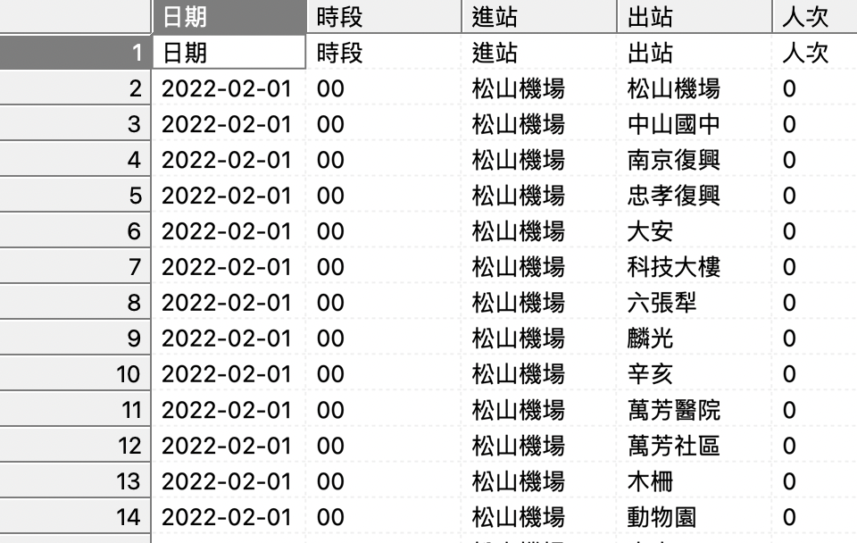
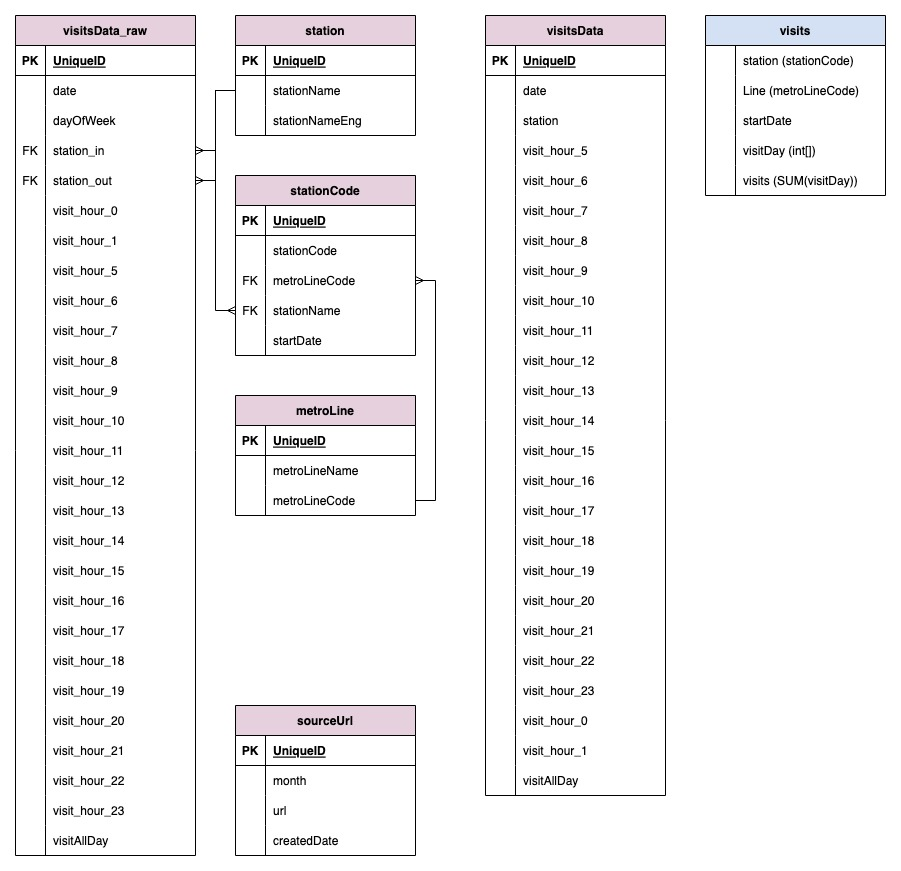

# downloadMRTData

### Introduction

This repository is some tools to fetch preliminary data for my [project](https://github.com/ker07/TaipeiMRTData).

This repository contains:

- python code for crawling data from data source
- python code to generate SQL code for PostgreSQL database creation/injection
- SQL code to create table or inject those data into PostgreSQL database

### What these code did

The csv file containing **monthly** data can be fetched from online source. Data were stored as structure showed below (demo file in folder  /raw)

- Column name in translation:
    - Date
    - Hour (mostly 00~01, 05~23) [MRT were closed during 02~04]
    - Station which visits get in
    - Station which visits get out
    - Visits

Obviously, this file contains enormously repeated columns. That makes it quite huge(>300MB per month) and number of rows grows extremely fast(8 million per month).

In order to make it more suitable for storing in relational database, I did some cleaning and design tables based on structures showed in picture below.

The visitData_raw table was used to store those raw data. The visitData table was generated by joining same station_in. The visitsDay column(int[]) in visits table contains series of daily-visit-data from visitData.visitAllDay.

The visits table(labeled in blue) is the only table deployed on heroku-postgres due to space and column limitation of free-plan on heroku-data website.

### Preliminary result

files of data from **2017-01** to **2022-02** were store locally and daily visits data were deploy online for project usage.

### Future work

These code can be used to full-automatically fetch new data for the project.

### Tools used in this project:

- Programing language
    - Python
    - SQL
- Software
    - Pycharm
    - Visual Studio Code
    - Postgres
    - pgAdmin 4
- Website
    - Draw database design pattern: [https://app.diagrams.net/](https://app.diagrams.net/)
    - Data Source: [https://data.gov.tw/dataset/128506](https://data.gov.tw/dataset/128506)

## Follow-up project:[TaipeiMRTData](https://github.com/ker07/TaipeiMRTData)